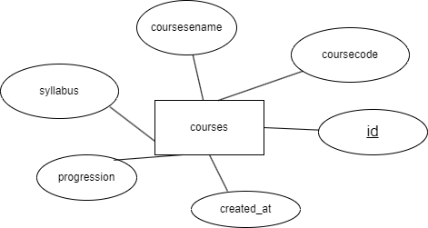

# Kursadministrationssystem

[](./docs/er-diagram.png)

##  Systemöversikt
Ett fullstack webbapplikation för kursadministration med:
- **Backend**: Node.js + Express
- **Databas**: PostgreSQL
- **Frontend**: EJS + CSS

## Huvudfunktioner
- Visar kurslista med sortering
- Formulär för ny kurs med validering
- Radera kurser direkt
- Responsiv design för alla enheter
##  Databasstruktur

### Tabell: courses

| Fält          | Typ                | Beskrivning                   |
|---------------|--------------------|-------------------------------|
| id            | SERIAL (PRIMARY KEY)| Automatisk primärnyckel       |
| coursecode    | VARCHAR(10)        | Kurskod (unik)                |
| coursename    | VARCHAR(64)        | Kursnamn                      |
| syllabus      | TEXT               | Länk till kursplan            |
| progression   | CHAR(1)            | Progression (A/B)             |
| created_at    | TIMESTAMP          | Skapandedatum (auto-genererad)|

##  Installation
0. Klona repot:
```bash
git clone https://github.com/Hananmutlak/cv.web.git